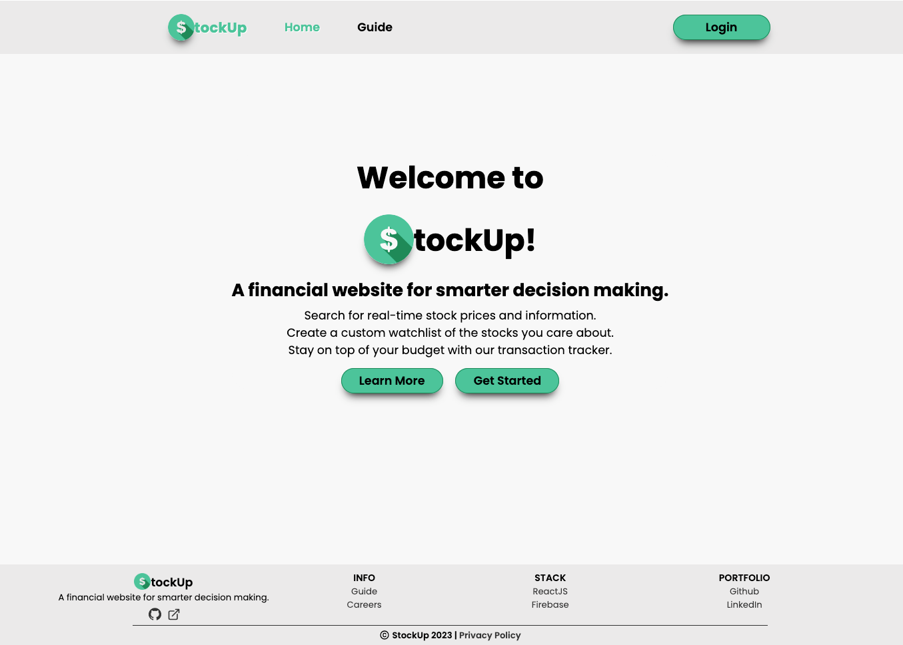
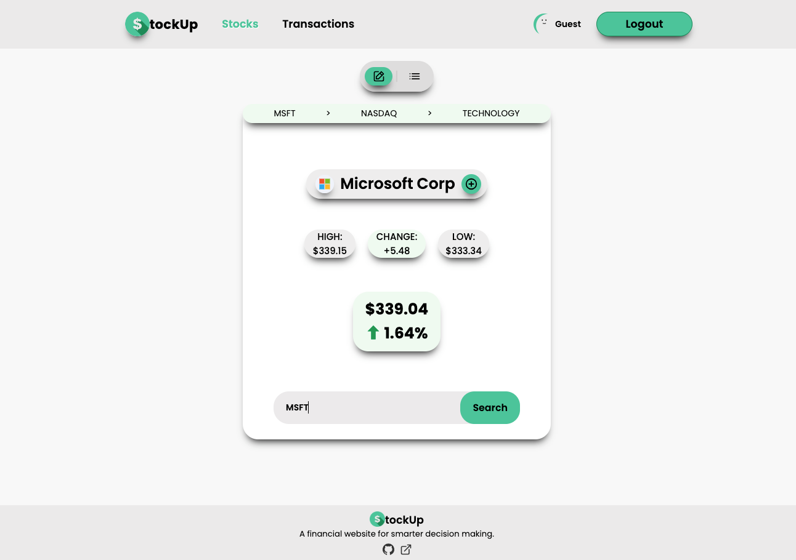
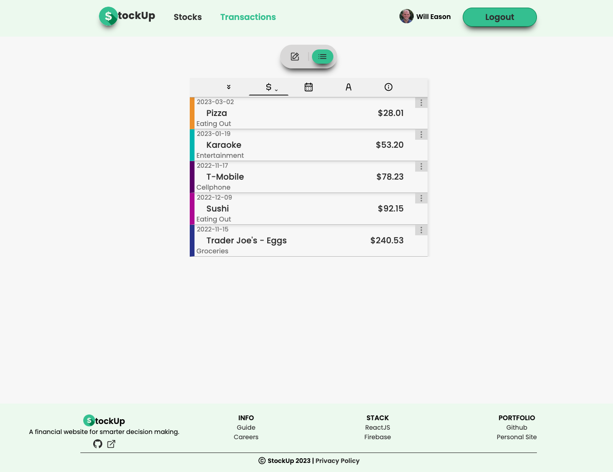

# StockUp

[StockUp](https://stockupfinance.app) is a finance and stock tracker created to help the user make smarter financial decisions.

---

## Table of Contents

- [Technologies and Languages](#technologies-and-languages)
- [Usage](#Usage)
  - [Signup/Login](#signuplogin)
  - [Authenticated User Features](#authenticated-user-features)
    - [Stocks](#stocks)
      - [Stock Search](#stock-search)
      - [Stock Watchlist](#stock-watchlist)
    - [Transactions](#transactions)
    - [User Features](#user-features)
- [Future Features](#future-features)
- [License](#license)
- [Disclaimer](#disclaimer)

## Technologies and Languages

- ReactJS
- JavaScript
- Google Firebase
- CSS
- HTML5

### Notable Dependencies

- [framer-motion](https://www.npmjs.com/package/framer-motion)
- [react-media](https://www.npmjs.com/package/react-media)
- [react-router](https://www.npmjs.com/package/react-router)
- [react-unicons](https://www.npmjs.com/package/@iconscout/react-unicons)
- [boring-avatars](https://www.npmjs.com/package/boring-avatars)

## Usage

### Signup/Login

Users have 4 options for signing up:

- manually enter email, password, display name
- using their Google account
- using their Facebook account
- try it out anonymously with a Guest account

---

### Authenticated User Features

#### Stocks

---

##### Stock Search

- Lookup pricing information and other metrics using the stock symbol
- Add stock to watchlist from symbol lookup with single button press
- Get suggested stock symbols using the name of the company

---

##### Stock Watchlist

- Add stocks to watchlist using a form
- Give watchlist a custom name
- Update watchlist name
- Edit/Update stock watchlist items
- Delete stocks from watchlist
- Shows stock symbol and name
- Shows gain or loss on day based on background color
- Shows percentage gained or loss for each stock
- Shows current stock prices

#### Transactions

---

- Create and view transactions with name, amount, date, category, and color
- Filter transactions to view only a specific category
- Sort transactions alphabetically, by transaction date, and by amount
- View largest, smallest, total, and average transaction amounts
- Edit/Update a transaction
- Delete transactions

## User Features

- Ability to change user name
- Ability to delete account

## Future Features

- Ability to change or add profile picture
- Additional metrics for transactions
- Ability to update and create new categories

## License

Stock prices and information are retrieved using the [Finnhubb API](https://finnhub.io/docs/api), suggested search results are retrieved using the [AlphaVantage API](https://www.alphavantage.co/).

## Disclaimer

Any suggestions or features are not financial advice, invest at your own risk.

---

- [Back To Top](#StockUp)
